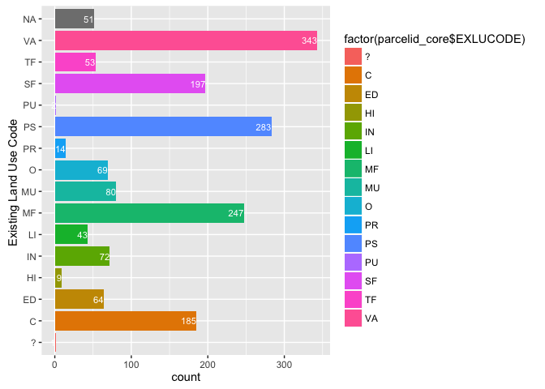
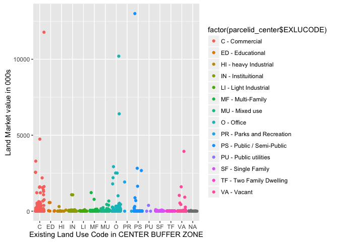
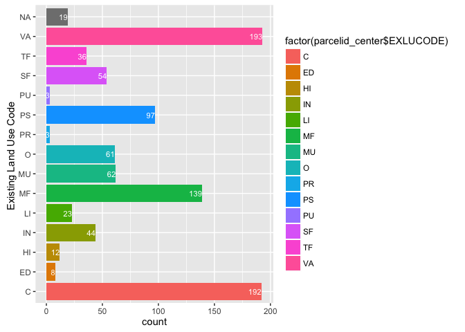
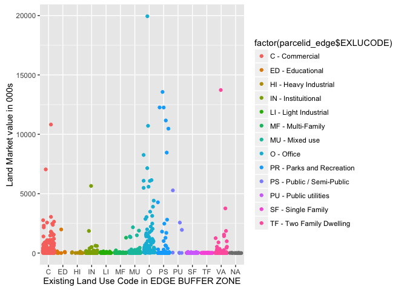
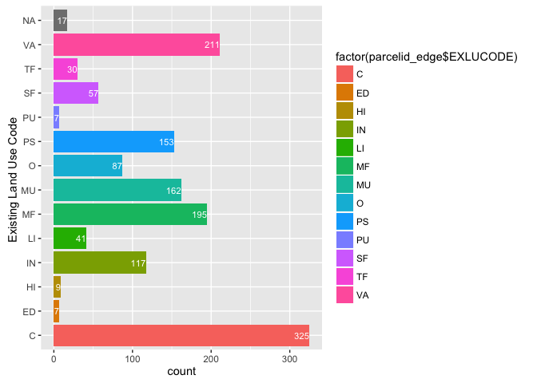

ExploratoryDataAnalysis
================
Rajesh Jagannath
August 3, 2016

### 1. Introduction

I am using Datasets provided by Cincinnati Area Geographic Information System (CAGIS). A Street car is being introduced in the City of Cincinnati. Its economic benefit is being analyzed and forecast in this Project. A Buffer zone has been established around the street-car route. It is further divided into CORE, CENTER and EDGEA subset of features have been seleced from the original .csv file. In the following section we explore the data in 3 csv files by plotting the market Land Value and a count of onbservations catergorized by Existing Land Use Code.

### 2. Pre-Procesing

This program reads in the CENTER, EDGE and CORE csv files

``` r
library(dplyr)
library(RSQLite)
library(tidyr)
library(ggplot2)
library(readr)
library(stringr)
library(scales)
library(mixtools)
library(readxl)
library(ggmap)
```

### 3. Data Loading

``` r
# read in the csv 
stcar_center <- read_csv("./streetcarbuffer_parcels/parcel_csv_050616/StreetCarParcels_CENTER.csv")
stcar_core   <- read_csv("./streetcarbuffer_parcels/parcel_csv_050616/StreetCarParcels_CORE.csv")
stcar_edge   <- read_csv("./streetcarbuffer_parcels/parcel_csv_050616/StreetCarParcels_EDGE.csv")
```

### 4. Prepare data

Subset some interesting features - PARCELID, Existing Land Use Code, Mkt value of the land/ improvements, Sale Amt., Area and Acres

``` r
selected_var_v <- c("PARCELID", "EXLUCODE", "MKTLND", "MKTIMP", "MKT_TOTAL_", "SALDAT","SALAMT","FORECL_FLA", "AREA","ACRES")


parcelid_center<- stcar_center[selected_var_v]
parcelid_edge  <- stcar_core[selected_var_v]
parcelid_core  <- stcar_edge[selected_var_v]
```

### 5a. Exploratory Analysis on Dataset - CORE

``` r
str(parcelid_core)
```

    ## Classes 'tbl_df' and 'data.frame':   1713 obs. of  10 variables:
    ##  $ PARCELID  : chr  "007400010001" "007400010002" "007400010003" "007400010004" ...
    ##  $ EXLUCODE  : chr  "?" "VA" "VA" "VA" ...
    ##  $ MKTLND    : num  96970 108230 150140 437770 0 ...
    ##  $ MKTIMP    : num  1.9e+08 0.0 0.0 0.0 0.0 ...
    ##  $ MKT_TOTAL_: num  0 0 0 0 0 0 0 0 0 0 ...
    ##  $ SALDAT    : int  40777 40777 40777 40777 0 40777 0 0 40777 40777 ...
    ##  $ SALAMT    : num  0 0 0 0 0 0 0 0 0 0 ...
    ##  $ FORECL_FLA: chr  NA NA NA NA ...
    ##  $ AREA      : num  0 0 0 0 0 0 0 0 0 0 ...
    ##  $ ACRES     : num  0 0 0 0 0 0 0 0 0 0 ...

Total number of parcels and the mean Market value of the Land in CORE

    ## [1] "Total number of parcels in CORE is          1713"

    ## [1] "The mean Market value of the land in CORE   155471.593695271"

    ## [1] "The count of parcels with 0 MKT value is     427"

#### Plot- CORE

Most High Value properties are in the Core buffer area are C- Commercial, VA - , PS - and O- Office We need to remove or impute the lone data with LandUse classified as "?" One office building has Mkt Land value of 25Million



5b.Exploratory Analysis on Dataset - CENTER
-------------------------------------------

Total number of parcels and the mean Market value of the Land in CENTER

    ## Classes 'tbl_df' and 'data.frame':   946 obs. of  10 variables:
    ##  $ PARCELID  : chr  "007500010007" "007500010005" "007500010008" "007500010009" ...
    ##  $ EXLUCODE  : chr  "C" "O" "C" "C" ...
    ##  $ MKTLND    : num  0 28180 24250 25350 23880 ...
    ##  $ MKTIMP    : num  0 90810 1570 1960 1570 ...
    ##  $ MKT_TOTAL_: num  0 0 0 0 0 0 0 0 0 0 ...
    ##  $ SALDAT    : int  0 42153 39552 39552 39552 39552 39552 39552 0 2 ...
    ##  $ SALAMT    : num  0 0 275000 275000 275000 275000 275000 275000 0 0 ...
    ##  $ FORECL_FLA: chr  NA NA NA NA ...
    ##  $ AREA      : num  0 0 0 0 0 0 0 0 0 0 ...
    ##  $ ACRES     : num  0 0 0 0 0 0 0 0 0 0 ...

    ## [1] "Total number of parcels in CENTER is                  946"

    ## [1] "The mean Market value of the land in ENTER            146591.532769556"

    ## [1] "The count of parcels in CENTER  with 0 MKT value is   175"

#### Plot - CENTER



5c. Exploratory Analysis on Dataset - EDGE
------------------------------------------

    ## Classes 'tbl_df' and 'data.frame':   1418 obs. of  10 variables:
    ##  $ PARCELID  : chr  "007800020108" "008100040098" "008100040099" "008100040101" ...
    ##  $ EXLUCODE  : chr  "O" "PS" "LI" "VA" ...
    ##  $ MKTLND    : num  360650 6000 12080 12040 15030 ...
    ##  $ MKTIMP    : num  0 0 17090 0 148730 ...
    ##  $ MKT_TOTAL_: num  0 0 0 0 0 0 0 0 0 0 ...
    ##  $ SALDAT    : int  30042 2 38569 38448 41822 41411 32874 40122 40122 31444 ...
    ##  $ SALAMT    : num  0 0 345700 0 70970 ...
    ##  $ FORECL_FLA: chr  NA NA NA NA ...
    ##  $ AREA      : num  0 0 0 0 0 0 0 0 0 0 ...
    ##  $ ACRES     : num  0 0 0 0 0 0 0 0 0 0 ...

#### Total records in EDGE

``` r
print(paste("Total number of parcels in EDGE is           ", nrow(parcelid_edge)))
```

    ## [1] "Total number of parcels in EDGE is            1418"

``` r
print(paste("The mean  Market value of the land in EDGE is", mean(parcelid_edge$MKTLND)))
```

    ## [1] "The mean  Market value of the land in EDGE is 289340.155148096"

``` r
print(paste("The count of parcels with 0 MKTLND value is  ", length(which(parcelid_edge$MKTLND == 0))))
```

    ## [1] "The count of parcels with 0 MKTLND value is   69"

#### Plot - EDGE



Note that the `echo = FALSE` parameter was added to the code chunk to prevent printing of the R code that generated the plot.
